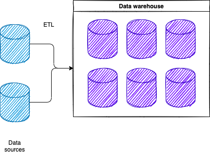
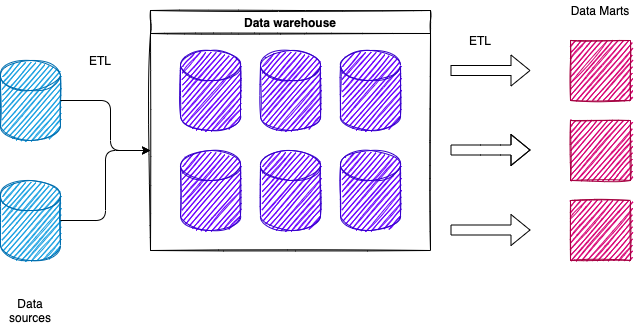

 <table class="center" style="margin-left:auto;margin-right:auto">
  <tr>
    <th><a href="../">Home</a></th>
    <th><a href="./02-data-warehousing-architecture">(Next) Data Warehousing Arquitecture</a></th>
  </tr>
</table> 

# Data Warehousing Concepts

## What is a data warehouse?
A data warehouse is usually built on top of a databaee but it is not the same as a database.

You can think of the warehouse as the _usage_ and the database as the _platform_.

It's important to note that the data inside a data warehouse is coming from SOMEWHERE else. We don't create data for the first time in the data warehouse, the transactions occur somewhere else and the data is then sent to the warehouse.

*Critical point*: Data is copied not moved to the warehouse.

Some rules (Bill Inmon, 1990):
* Integrated
* Subject oriented
* Time variant
    - A fancy way of saying the data warehouse contains historical data, not just current.
* Non volatile
    - In traditional data warehouse usage, the warehouse **remains stable** in between refreshes. 
    - This is so we can do things like strategic planning without the data changing between us.

We build these systems like this is to support data-driven decision-making.

## Reasons to Build a Data Warehouse

1. Make data-driven decisions - **Business Intelligence**
2. One stop shopping - all the data is in one place rather than in each of the systems/sources. 

## Data Warehouse vs Data Lake
A data warehouse is usually built on top of a Relational Database Management System (RDBMS). Sometimes on top of a Multidimential DB aka a "cube."

In contrast, a data lake is built on top of a big data environment rather than a RDBMS.

Some people think of data lakes as the next generation of data warehousing.

To blur the difference further, you can run SQL on both environment. You could do traditional BI against either data warehouses **or** data lakes.

## Data Virtualization
_Another discipline_

In the beginning... in the 1980s data-driven decision-making was done using _*extract files*_. Far more time was gathering and organizing data than actually analyzing data.

> "They were exactly as they sounded. Sort of mini data warehouses pulling data from one or more applications but without any coordination of data structures, rules or pretty much anything else. Far more time was spent gathering and re-organizing data over and over than actually analyzing data."

In the late 80s, Distributed DBMS (DDBMS) come along. Think about an internet search engine but instead of an index of website the index pointed to applications and their databases and specific data. In theory, you could write a query against the DDBMS regardless of how disperse the data actually was. The index would then reach to the appropriate places, pull in the correct data, organize it and present the results to you. 

The concept was solid but in practice it was mostly a failure. However, it seems like this was an early iteration of what Hadoop does now to support the distributed usage of data. 

This lead to two paths:
1) data warehousing - instead of grabbing data on demand (in its original applications and databases) let's preemtively get a copy of what we think we will need and then integrate those in some sort of a totally different environment.
2) data virtualization - Read-only DDBMS. The original idea allowed creating and updating data. The main idea behind this is that we don't copy data - we access it in-place. This has had other names: virtual data warehousing, enterprise information integration (EII), enterprise data access (EDA), now: data virtualization.

It's very niche.
Data virtualization is particularly useful in certain cases:
1. We have data that requires simple or no transformations
2. We have only a handful of data sources
3. We have some leeway in our response time of our queries and reports

## A Simple End-to-End Data Warehouse Environment
A typical data warehouse environment.

A data warehouse is built by pulling data from other sources. In between the data source and the data warehouse there is a critical step: ETL.

* Extract
* Transform
* Load

A more complex example. 

Sometimes we don't stop with copying and pulling data into the data warehouse. Sometimes we will continue to copy and pull the data into smaller environments that are typically referred to as data marts.

One way to think of this is: Data sources are suppliers, a data warehouse is a wholesaler, and data marts are retailers. These data marts are where users do most of their data shopping since data marts have specific subsets tailored to different groups of users. Perhaps those from specific business organization or those who perform a specific business function.
